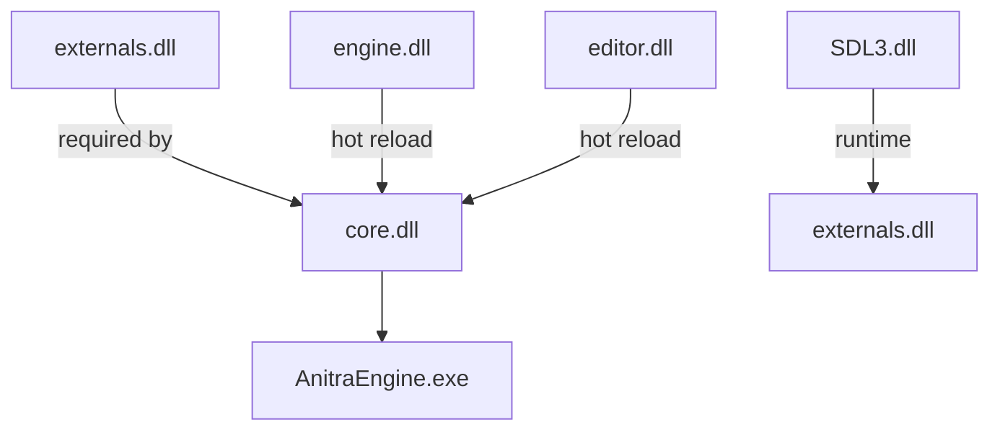

# Anitra Engine - DLL Dependency Graph

## Overview

Anitra Engine uses a multi-DLL architecture with clear separation of concerns. This document describes the dependencies between each DLL.

```
┌─────────────────────────────────────────────────────────────┐
│                     AnitraEngine.exe                        │
│  ┌────────────────────────────────────────────────────────┐ │
│  │   Main entry point (main.c)                            │ │
│  │   - Loads core_copy.dll                                │ │
│  │   - Monitors hot-reload events                         │ │
│  │   - Manages game loop                                  │ │
│  └────────────────────────────────────────────────────────┘ │
└───────────────────────┬─────────────────────────────────────┘
                        │
                        │ load_core_func()
                        ▼
┌─────────────────────────────────────────────────────────────┐
│                      core.dll                               │
│  ┌────────────────────────────────────────────────────────┐ │
│  │   Hot-reload coordinator (core.c)                      │ │
│  │   - Manages DLL loading/unloading                      │ │
│  │   - Handles hot-reload events                          │ │
│  │   - Coordinates teardown/reinitialization              │ │
│  └────────────────────────────────────────────────────────┘ │
                        │                                     │
         ┌──────────────┴──────────────┐                      │
         │                             │                      │
         ▼                             ▼                      │
┌──────────────────┐        ┌─────────────────────────────┐   │
│    externals.dll │        │     engine.dll              │   │
│  ┌──────────────┐│        │  ┌───────────────────────┐  │   │
│  │ SDL3/GPU init││        │  │ Gameplay logic        │  │   │
│  │ UI rendering ││        │  │ - Physics             │  │   │
│  │ Font rendering││       │  │ - Animation           │  │   │
│  │ Clay UI      ││       │  │ - Scene management    │  │   │
│  └──────────────┘│       │  └───────────────────────┘  │   │
└──────────────────┘        └─────────────────────────────┘   │
         ▲                             ▲                      │
         │                             │                      │
         │              ┌──────────────┴──────────────┐      │
         │              │           editor.dll        │      │
         │              │  ┌───────────────────────┐  │      │
         │              │  │ Docking system        │  │      │
         │              │  │ Profiler panels       │  │      │
         │              │  │ UI rendering          │  │      │
         │              │  └───────────────────────┘  │      │
         └──────────────┴──────────────────────────────┘      │
```

## DLL Dependencies

### core.dll → externals.dll (load once)
- **Purpose**: Initialize GPU device, UI systems, and other external libraries
- **Functions called**:
  - `init_externals(memory *g)` - Initialize all externals subsystems
  - `update_externals(memory *g)` - Update externals each frame
  - `end_externals(memory *g)` - Cleanup externals on shutdown

### core.dll → engine.dll (hot reload)
- **Purpose**: Gameplay logic, physics, animation
- **Functions called**:
  - `init_engine(memory *g)` - Initialize gameplay systems
  - `update_engine(memory *g)` - Update game state each frame
  - `destroy_engine(memory *g)` - Cleanup game state

### core.dll → editor.dll (hot reload)
- **Purpose**: Dockable UI panels, profiler, inspector
- **Functions called**:
  - `init_editor(memory *g)` - Initialize editor systems
  - `update_editor(memory *g)` - Update editor each frame
  - `destroy_editor(memory *g)` - Cleanup editor state

### externals.dll → SDL3 (runtime)
- **Purpose**: Window management, GPU API, input handling
- **No compile-time dependency** - loaded via SDL3 DLL

### externals.dll → Tracy (optional, runtime)
- **Purpose**: Profiling and debugging
- **Conditional compilation** - only when TRACY_ENABLE defined

## Hot Reload Architecture

```
┌─────────────────────────────────────────────────────────────┐
│                      Game Loop                              │
├─────────────────────────────────────────────────────────────┤
│  while (game_running) {                                     │
│    if (reload_signal_received) {                            │
│      // Phase 1: Teardown                                  │
│      destroy_engine(&g);                                    │
│      end_externals(&g);                                     │
│                                                             │
│      // Phase 2: DLL Reload                                │
│      unload_library(engine_lib);                            │
│      copy_to_temp("engine.dll", "engine_copy.dll");         │
│      engine_lib = load_library("engine_copy.dll");          │
│                                                             │
│      // Phase 3: Re-initialize                            │
│      assign_functions(engine_lib);                          │
│      init_engine(&g);                                       │
│    }                                                        │
│                                                             │
│    update_externals(&g);                                    │
│  }                                                          │
└─────────────────────────────────────────────────────────────┘
```

## Memory Management

### Arena Hierarchy
```
memory.arena (main scratch arena)
├── gameplay sub-arena (survives reloads)
│   ├── entities
│   ├── scene data
│   └── loaded assets
└── editor_arena (reset on reload)
    ├── UI contexts
    └── temporary buffers
```

### Hot Reload Safety
1. **Gameplay state** allocated from `gameplay` arena persists across reloads
2. **Temporary data** uses main arena, reset each frame
3. **GPU resources** managed by externals, recreated on reload

## DLL Build Order



## Build Dependencies

### Required Libraries
- **SDL3** - Window, GPU API, input
- **SDL_shadercross** - Shader compilation from SPIR-V
- **Tracy** (optional) - Profiling
- **HarfBuzz** - Text shaping
- **Clay UI** - Immediate mode UI
- **cgltf** - glTF model loading

### Build Tools
- TCC (Tiny C Compiler) or MSVC
- SPIR-V compiler for shaders

## Linking Strategy

```
externals.dll:
  → imports SDL3 functions
  → exports init_externals, update_externals, end_externals

core.dll:
  → imports externals functions
  → imports engine/editor functions (via function pointers)
  → exports init_core (main entry point)

engine.dll:
  → no external dependencies (self-contained)

editor.dll:
  → imports Clay UI
  → exports editor panel functions
```

## File Locations

```
src/
├── externals/externals.c     # externals.dll source
├── core/core.c               # core.dll source
├── engine/*.c                # engine.dll sources
└── editor/editor.c           # editor.dll source
```

## Hot Reload Events (Windows)

| Event Name | Purpose |
|------------|---------|
| `Global\ReloadEvent` | Trigger engine.dll reload |
| `Global\ReloadEditorEvent` | Trigger editor.dll reload |
| `Global\ReloadCoreEvent` | Full restart (core.dll) |
