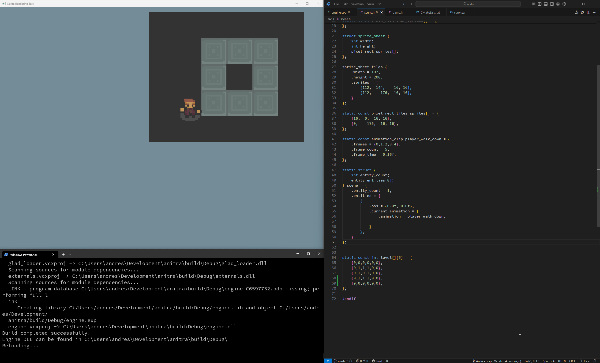
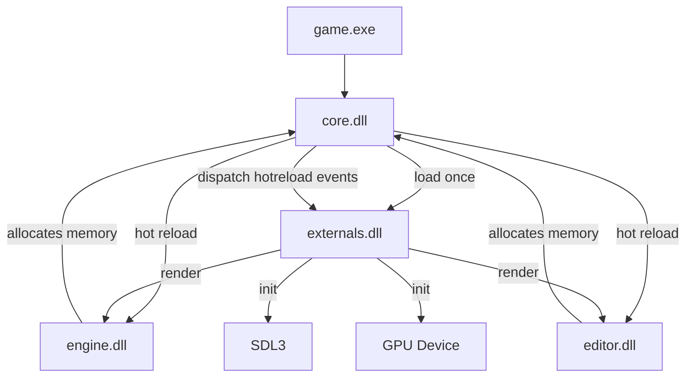

# Anitra Engine

A data-oriented game engine built with C, SDL3, and SPIRV shaders.



## Overview

Anitra Engine is designed for **live code iteration** - edit your C code and see changes instantly without recompiling or restarting the game. Built using SDL3 for cross-platform window management and GPU rendering with SPIRV shaders.

### Hot Reloading Workflow


```mermaid
graph TD;
    A[game.exe] --> B[core.dll];
    B --> |load once| C[externals.dll];
    B --> |hot reload| D[engine.dll];
    B --> |hot reload| E[editor.dll];
    D --> |allocates memory| B;
    E --> |allocates memory| B;
    C --> |render| D;
    C --> |render| E;
    C --> |init| F[SDL3];
    C --> |init| G[GPU Device];
    B --> |dispatch hotreload events| C
```

## Features

### Current Features
- **Instant code iteration**: Edit C files and reload via `Ctrl+R` - no rebuild needed
- **Data-oriented architecture** for optimal performance
- **SDL3 + GPU API** with SPIRV shader pipeline
- **Dockable UI system** with offscreen rendering panels
- **3D skinned animation** with glTF support
- **Entity-component system** with arena-based memory management
- **Debug rendering** with line primitives and collision visualization

### Planned Features
- Asset bundling and streaming system
- Physics engine integration (Havok/PhysX or custom)
- Audio system using miniaudio
- Network synchronization for multiplayer
- Procedural generation tools
- Level editor integration

## Prerequisites

- **Windows**: Visual Studio 2022 (or use TCC compiler included in repo)
- **Linux**: GCC or Clang with C17 support
- **GPU**: Direct3D 12 or Vulkan-capable GPU

## Building

### Quick Start (Recommended)

This project uses a Python-based build system for better readability and maintainability:

```batch
# Windows (Python build system - recommended)
python build.py all

# Or use the batch wrapper
py_build.bat all

# Linux/Unix
python3 build.py all
```

### Traditional Build System (Legacy)

The original C-based build system is still available:

```batch
# Using TCC compiler
.\build.bat all

# Using MSVC from Developer Command Prompt  
.\build.bat all
```

### Build Targets
### Build Targets
- `all` - Build everything (default)
- `externals`, `core`, `engine`, `editor` - Build individual DLLs
- `exe` - Build AnitraEngine.exe
- `clean` - Remove all build artifacts

## Hot Reloading
- `exe` - Build AnitraEngine.exe
- `clean` - Remove all build artifacts
- `clean` - Remove all build artifacts
### Triggering a Reload

During development, press **Ctrl+R** in the game window to trigger hot reload. This will:
1. Unload engine/editor DLLs
2. Copy new DLL versions from source
3. Re-initialize with preserved gameplay state

### Live Code Editing Workflow

1. Open `src/engine/*.c` in your editor
2. Make a code change (e.g., modify movement speed, add debug rendering)
3. Press **Ctrl+R** in the running game
4. See changes instantly without recompilation or restart!

### Memory Persistence

Gameplay state stored in the `gameplay` arena survives reloads:
- Entity positions and velocities
- Camera settings
- Scene objects
- Loaded assets (GPU resources)

Temporary data uses the main arena and is reset on each frame.

## Project Structure
## Project Structure

```
anitra-engine/
├── src/
│   ├── main.c              # Entry point with hot-reload loop
│   ├── game.h              # Core data structures (memory, scene, input)
│   ├── export.h            # DLL exports and function typedefs
│   ├── arena.h             # Memory arena allocator
│   ├── core/
│   │   ├── core.c          # Hot-reload coordinator, event handling
│   │   └── loadlibrary.*   # DLL copying and loading utilities
│   ├── externals/
│   │   └── externals.c     # SDL3/GPU initialization, UI rendering
│   ├── engine/
│   │   ├── engine.c        # Gameplay logic, physics, animation
│   │   ├── renderer.c      # 2D rendering, camera, draw lists
│   │   ├── scene.c         # Scene management
│   │   ├── physics.c       # Collision detection
│   │   ├── anim.c          # Skeleton animation
│   │   └── gltf_loader.c   # glTF model loading
│   └── editor/
│       └── dock.*          # Docking system for UI panels
├── assets/                 # Game assets (sprites, fonts, shaders)
├── scripts/                # Build and development scripts
└── build.c                 # Self-hosted build system source
```

## Hot Reloading

### How It Works
1. **Game loop** (`main.c`) continuously monitors for reload signals
2. When `Ctrl+R` is pressed (or event triggered), it:
   - Calls `destroy_engine()` and `end_externals()`
   - Copies DLL files to `_copy` variants (bypassing file locks)
   - Loads new DLL versions
   - Calls `init_engine()` and `init_externals()`
3. **Memory persists** through the reload via arena allocator

### Hot Reload Triggers
- **Engine**: `Global\ReloadEvent` Windows event
- **Editor**: `Global\ReloadEditorEvent` Windows event  
- **Core**: Polls `Global\ReloadCoreEvent` in game loop

## Architecture Details

### Memory Management
```c
typedef struct memory {
    arena arena;          // Main scratch arena
    arena *gameplay;      // Sub-arena for game state (survives reload)
    arena *editor_arena;  // Sub-arena for editor UI
    
    void *clay_game;      // Clay UI context for in-game UI
    void *clay_editor;    // Clay UI context for editor panels
    
    GltfModel loaded_model;
    mesh3d_state mesh3d;  // 3D skinned mesh state
} memory;
```

### DLL Responsibilities
| DLL | Responsibility |
|-----|---------------|
| `core.dll` | Hot-reload coordinator, thread management |
| `externals.dll` | SDL3/GPU init, shader compilation, UI rendering |
| `engine.dll` | Gameplay logic, physics, animation |
| `editor.dll` | Docking system, panel rendering, profiler |

## Development

### Adding New Features
1. Edit source files in `src/`
2. Trigger hot reload (`Ctrl+R`)
3. Changes appear instantly in running game

### Debugging Hot Reload
- Check `core.c` for reload event handling
- Verify DLL copy operations succeed (no file locks)
- Use `TRACY_ZONE_SCOPED` markers to profile reload time

## Contributing

Anitra Engine is actively developed. While the API is still evolving, contributions are welcome:

1. Fork the repository
2. Create a feature branch (`git checkout -b feature/amazing-feature`)
3. Commit changes (`git commit -m 'Add amazing feature'`)
4. Push to branch (`git push origin feature/amazing-feature`)
5. Open a Pull Request

## License

This project is licensed under the MIT License - see the [LICENSE.md](LICENSE.md) file for details.

## Acknowledgments

- SDL3 contributors
- SPIRV-Cross project
- Clay UI library
- glTF specification and related tools
- Tracy profiler
