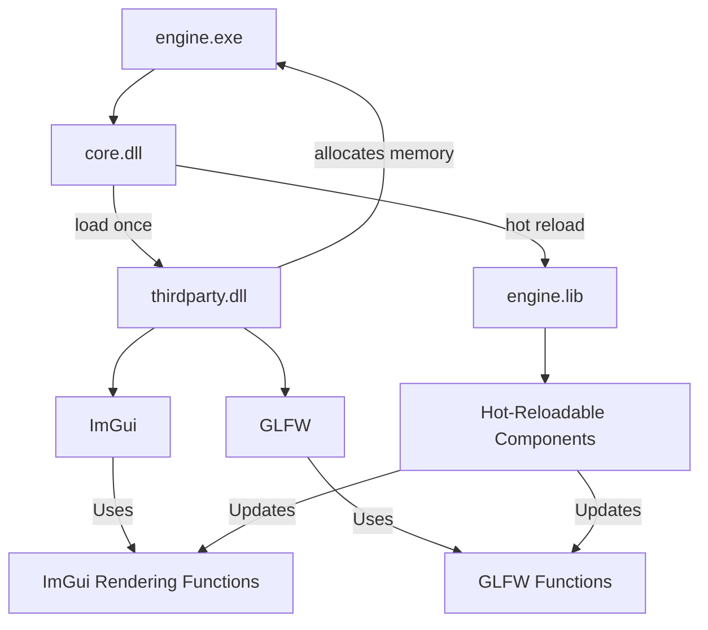

# Anitra Engine

A data-oriented game engine built with C99 and GLFW.

## Overview

Anitra Engine is designed with performance and flexibility in mind, utilizing data-oriented design principles to create an efficient and scalable architecture. Built using C99 for broad compatibility and GLFW for cross-platform window management and input handling.

## Features

Current features:
- Data-oriented architecture for optimal performance
- Cross-platform support via GLFW
- Modern OpenGL rendering
- Entity-component system
- DLL hot reloading

Planned features:
- ImGui integration for debug UI and tools
- glTF support for 3D model loading
- STB libraries integration for image loading and data structure containers
- Expanded hot reloading capabilities

## Prerequisites

- CMake (version 3.12 or higher)
- Visual Studio 2022

## Building

This project uses CMake as its build system. To build the project:

1. Clone the repository:

    ```batch
    git clone https://github.com/yourusername/anitra-engine.git
    ```

2. Generate the project files:

    ```batch
    cd anitra-engine
    ./generate.bat
    ```

3. Build the project:

    ```batch
    ./build.bat
    ```

## Project Structure
this is at a high level the design that I have in mind for the engine


```batch
anitra-engine/
├── src/
│   ├── core/
│   │   ├── core.c
│   │   └── ...
│   ├── engine/
│   │   ├── engine.c
│   │   └── ...
│   └── main.c  // main entry point
├── include/
│   ├── core/
│   │   ├── core.h
│   │   └── ...
│   ├── engine/
│   │   ├── engine.h
│   │   └── ...
├── lib/
│   ├── glfw/
│   ├── imgui/
│   ├── stb/
│   └── ...
├── thirdparty/
│   └── ...
├── build/
│   └── ...
├── CMakeLists.txt
├── generate.bat
├── build.bat
├── build.sh
└── README.md
```

## Roadmap

- Implement basic rendering pipeline
- Add entity-component system
- Integrate ImGui for debug UI
- Implement glTF support
- Add STB libraries for image loading and data structures
- Expand hot reloading capabilities
- Develop asset pipeline
- Create documentation and examples

## Contributing

Anitra Engine is in its early stages of development. While we're not yet ready for major contributions, we welcome feedback and suggestions. Please feel free to open issues for feature requests or bug reports.

## License

This project is licensed under the MIT License - see the [LICENSE.md](LICENSE.md) file for details.

## Acknowledgments

- GLFW contributors
- ImGui developers (future integration)
- STB libraries by Sean Barrett (future integration)
- glTF specification and related tools (future support)
